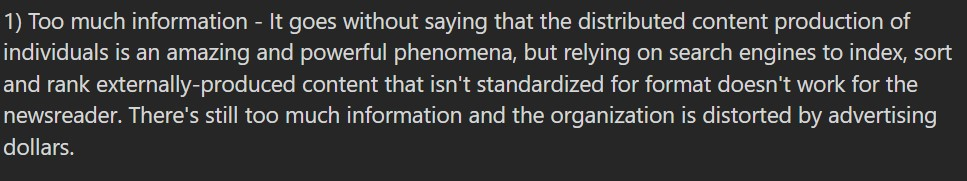

# 📰 NewsSummarizer

A modern, responsive news discovery platform engineered to solve News Fatigue and Information Overload. Built with React, Tailwind CSS, and Supabase, this app provides real-time news with AI-generated summaries to help users stay informed without the mental exhaustion of traditional media consumption.

## 🧠 The Problem (Research-Driven)

My research into modern audience engagement revealed a growing crisis in how people consume information. The following pain points served as the foundation for this project:


### 

Audiences are becoming overwhelmed by the sheer volume of news, leading to a "fatigue" that causes them to stop engaging with current events entirely.

### 

Users expressed frustration with the length of modern articles. The common sentiment is: "I just need to know the main topic, not read 2 million words."

### 

Content production is often distorted by advertising models rather than user needs, making it difficult for readers to find structured, unbiased summaries.

---

## 🚀 User Stories & Solutions

### 🎯 Story 1: Instant Information Digest

**As a** busy professional, **I want** to read a 3-sentence summary of long news articles **so that** I can stay informed without spending hours reading full reports.

- **Solution:** Integrated an AI-powered summarization engine that distills complex reports into digestible bullet points.

### 🎯 Story 2: Reliable Data Access

**As a** user, **I want** a news feed that is always available **so that** I don't encounter "empty states" when external APIs fail.

- **Solution:** Built a custom RSS-to-Database pipeline (ETL) to ensure data ownership and 100% uptime.

### 🎯 Story 3: Verified & Secure Access

**As a** user, **I want** to be certain that my account is secure **so that** my reading usage is private.

- **Solution:** Implemented a strict signup-to-login flow with mandatory Terms of Service (TOS) agreement and password validation.

---

## 🛠️ Technical Challenges & Solutions

### 🏗️ The "Production Data" Pivot (RSS Ingestion)

**Challenge:** During deployment, the third-party News API became unreliable, hitting rate limits and causing feed failures.
**Solution:** I moved from a direct API dependency to a custom **ETL (Extract, Transform, Load)** pipeline.

- **Ingestion:** Fetches raw XML from high-authority RSS feeds.
- **Storage:** Parses and stores data in **Supabase (PostgreSQL)**.
- **UI:** The React app fetches from my own database, ensuring lightning-fast loads and reliability.

### 🔒 Secure Auth Lifecycle

**Challenge:** Supabase automatically logs users in upon signup, bypassing the intended "verification" step.
**Solution:** I implemented an asynchronous `signOut` call immediately following `signUp`. This forces a manual login, ensuring the user confirms their credentials and intentionally agrees to the site's terms.

---

## 🏗️ Complete Project Structure

### 🧩 Reusable UI Components (`/components`)

- **Navbar System**: Features **Navbar.jsx**, **DesktopMenu**, **MobileMenu**, and **HamburgerIcon** for a seamless responsive experience.
- **NewsCard.jsx**: The primary article display component.
- **SummaryCard.jsx**: Dedicated component for viewing saved AI summaries.
- **HeadlineSlider.jsx**: Interactive carousel for featured news stories.
- **Search.jsx**: Optimized search bar with debounced input.
- **Modals**: **LimitModal.jsx** (for usage tracking) and **SummaryModal.jsx** (for AI content).
- **UI Elements**: **Button.jsx**, **Categories.jsx**, **Footer.jsx**, **Form.jsx**, **Spinner.jsx**, **Error.jsx**, and **ThemeToggle.jsx**.
- **Tracking**: **SummaryCount.jsx** to monitor real-time AI usage.

### 📄 Application Pages (`/pages`)

- **NewsFeed.jsx**: The main dashboard displaying the aggregated news.
- **SavedSummary.jsx**: A private library for users to store and manage their AI summaries.
- **Authentication**: **Login.jsx**, **Signup.jsx**, **ForgotPassword.jsx**, and **ResetPassword.jsx**.

### ⚙️ Core Logic & Services

- **Context**: **AuthContext.jsx** (session management) and **NewsContext.jsx** (global data state).
- **Hooks**: **useSummary.js**, **useSummaries.js**, **useSavedSummary.js**, and **useSlide.js**.
- **Services**: **geminiService.js** (Google Gemini AI integration).
- **Utils/Lib**: **rssParser.js** (XML logic) and **supabase.js** (Database client).
- **Config**: **rssSources.js** (Source management).

## 🏗️ File Map

```text
news-summarizer/
├── public/                # Research images (1.jpg, 2.jpg, 3.jpg, 4.jpg)
├── src/
│   ├── components/        # Reusable UI (NewsCard  .jsx, Search.jsx, Navbar)
│   ├── context/           # Global State (AuthContext.jsx, NewsContext.jsx)
│   ├── hooks/             # Custom logic (useSummary.js, useSummaries.js)
│   ├── pages/             # App views (NewsFeed.jsx, Signup.jsx, Login.jsx)
│   ├── services/          # API logic (geminiService.js)
│   ├── utils/             # Helper functions (rssParser.js)
│   ├── lib/               # Third-party config (supabase.js)
│   └── App.jsx            # Main routing
├── .env                   # Environment variables
└── README.md              # Project documentation
```

---

## 🔧 Installation & Setup

1. **Clone the repository**

```bash
git clone https://github.com/yourusername/news-summarizer.git

```

2. **Install dependencies**

```bash
npm install

```

3. **Set Environment Variables** (`.env`)

```env
VITE_SUPABASE_URL=your_url
VITE_SUPABASE_ANON_KEY=your_key

```

4. **Run Dev Server**

```bash
npm run dev

```

---

## 🎓 Lessons Learned

Building **NewsSummarizer** provided deep insights into full-stack development, specifically regarding data integrity and the ethical use of AI.

### 1. Data Resiliency is Mandatory

Relying on a third-party API for "live" data proved to be a single point of failure. Moving to a custom **ETL (Extract, Transform, Load)** pipeline taught me how to manage data ownership and ensure 100% uptime, even when external services are throttled or down.

### 2. State Management Complexity

With global authentication, news feeds, and AI usage tracking all happening at once, I learned the importance of **React Context API** and **Custom Hooks**. Centralizing logic in hooks like `useSummary` and `useSummaries` kept the UI components clean and specialized.

### 3. The Power of "Research-First" Engineering

Starting with audience research into **News Fatigue** helped me prioritize features. Instead of just building another "News App," I focused on specific problems like "Information Standardization" and "Length Frustration," which led to the creation of the **Gemini AI** summarization integration.

### 4. UX & Security Balance

Implementing a strict `signUp` to `signOut` flow taught me how to balance "out-of-the-box" library features (like Supabase's auto-login) with my own security requirements to ensure users intentionally agree to Terms of Service and verify their access.

---

## 💻 Credits & Acknowledgments

- **Frontend Development**: A special thanks to **[@Irene-Munyewu](https://github.com/Irene-Munyewu)
  ** for programming the **Login** and **Signup** pages, translating the design into clean, functional code.

## 👤 Author

**Chisom Worlu**
_Software Developer focused on building resilient, research-backed solutions._

---
